---

  <table>
    <tr>
      <td align="center" width="45%">
        
      </td>
      <td align="center" width="55%">
        
      </td>
    </tr>
  </table>

---

## 👨‍💻 About Me

I'm an AI Engineer and Full-Stack Developer from Chennai, currently pursuing B.E. in Computer Science at Chennai Institute of Technology (CGPA: 8.54). I simultaneously intern as **SDE Intern at PICABORD Technologies** and **AI Engineer Intern at Snyco**, building production-grade agentic AI systems, LLM pipelines, and low-latency voice interfaces. My work lives at the intersection of **AI infrastructure**, **real-time systems**, and **developer tooling**.

---

## 🛠️ Tech Stack

**Languages**

**Frameworks & Libraries**

**AI / ML & Voice Tech**

**Cloud & Databases**

**Tools & Protocols**

---

## 📊 GitHub Statistics

## 🏅 Achievements

| 🏆 | Achievement | Details |
|:--:|:-----------:|:-------:|
| 🌍 | **ICPC 2025** | Global Rank **1729 / 3000** · Regional Rank **17 / 150+** (Sri Lanka Regionals) |
| ⚔️ | **LeetCode KNIGHT Badge** | Rating **1939** · [navdeep90](https://leetcode.com/navdeep90) |
| 💻 | **Codeforces Rated** | Rating **1049** · [NAVDEEP009](https://codeforces.com/profile/NAVDEEP009) |
| 🥇 | **Best Backend Functionality** | Gen AI Dev Hackathon — 2026 |
| 🏗️ | **Best Solution Architecture** | HackFinity SIMATS Hackathon — 2025 |

---

## 💼 Professional Experience

<b>🏢 PICABORD Technologies Pvt. Ltd. — SDE Intern</b> &nbsp;|&nbsp; May 2026 – Present &nbsp;|&nbsp; Remote

 

> 
> 
> 
> 

- 🧠 Engineered **NeuroNotes** — cognitive AI meeting layer generating live minutes, extracting action items, and enabling real-time semantic querying via LLM-powered RAG pipeline.
- 🤖 Automated post-meeting workflows via API integrations for AI-summarized email dispatch and Google Calendar scheduling, **eliminating manual follow-up overhead entirely**.
- 🗣️ Built a **multimodal live query interface** for natural language interrogation of meeting history, backed by FAISS vector search with dynamic visual response generation.

<b>🏢 Snyco — AI Engineer Intern</b> &nbsp;|&nbsp; June 2026 – Present &nbsp;|&nbsp; Remote

 

> 
> 
> 

- 🖥️ Architected backend for an **agentic AI desktop assistant**, streamlining complex terminal workflows through advanced natural language intent parsing.
- ✈️ Led **flight ticket booking team** — designed automated flight operations module with event-driven triggers for high-throughput real-time command execution pipelines.

<b>🏢 StoryWeaver (Pratham Books) — Open Source Developer</b> &nbsp;|&nbsp; Sep 2025 – Oct 2025 &nbsp;|&nbsp; Remote

 

> 
> 
> 

- ⚡ Built secure **OPDS XML-to-JSON parsing engine** with SSRF protection; boosted **API response speed by 40%** via multi-layer Redis + in-memory caching.
- 🛡️ Hardened API security with Helmet.js and Redis rate limiting; managed multilingual catalog state with React `useReducer` for persistent non-blocking UI.

## 🤝 Connect With Me

---

*"Build systems that think. Ship code that scales."*

